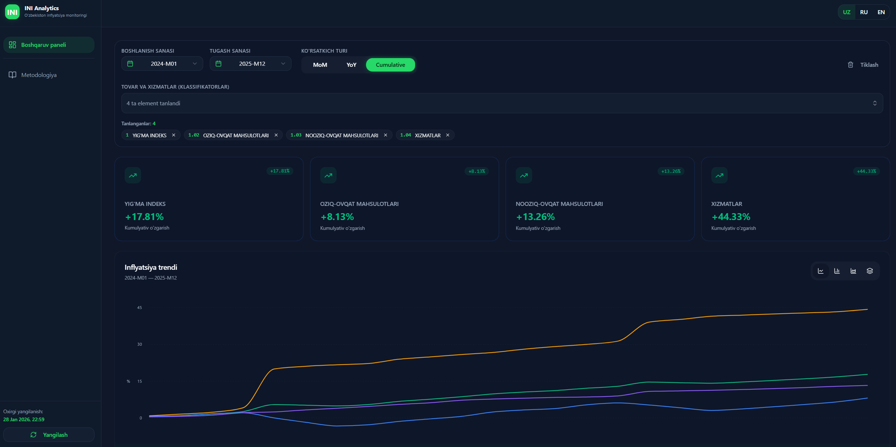
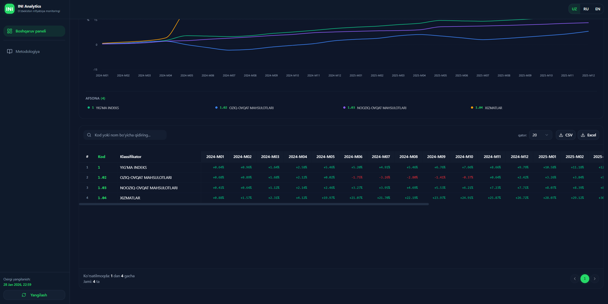
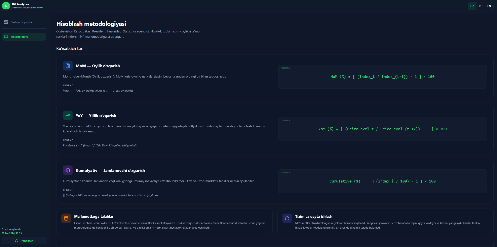

# Central Bank of Uzbekistan (CBU) — Price Index Analytics

A comprehensive, state-of-the-art analytics platform developed for the **Central Bank of Uzbekistan (CBU)** to monitor and analyze **Consumer Price Index (CPI)** data. This tool allows economists, analysts, and banks to visualize inflationary trends with high precision, interactive charts, and localized reports.

## Overview

The **CBU Analytics Dashboard** solves the challenge of processing and visualizing complex CPI data. By autonomously downloading official SDMX/Excel data provided by the Statistics Agency, the system computes critical economic indicators (MoM, YoY, Cumulative) and presents them through a premium, responsive interface tailored for central banking needs.

- **Objective:** Democratize access to price index analytics for the Central Bank.
- **Problem Solved:** Manually parsing government Excel files and calculating cumulative inflation is time-consuming and error-prone.
- **Audience:** CBU Economists, policy makers, data analysts, and institutional stakeholders.
- **Data Source:** Official Uzbekistan CPI data (sdmx.stat.uz).

## Features

- **Indicator Analytics:** Detailed tracking of MoM (Month-over-Month), YoY (Year-over-Year), and Cumulative inflation.
- **Dynamic Filters:** Filter by complex classifier hierarchies, narrow down date ranges, and switch between metric types instantly.
- **KPI Panel:** High-level summary of current economic health across 4 major commodity groups.
- **Interactive Visualizations:** Sleek, responsive charts (Recharts) and high-performance data tables with fixed columns.
- **Seamless Data Refresh:** Admin-triggered background data ingestion with real-time progress bars, ETAs, and **zero page reloads**.
- **Localization:** Full support for **Uzbek (UZ)**, **Russian (RU)**, and **English (EN)**.
- **Dual Export:** Export filtered reports directly to **CSV** or **Excel (XLSX)** format.
- **Design:** Premium dark theme with glassmorphism effects and smooth micro-animations.

## Tech Stack

### Frontend
- **Framework:** React 18 + Vite (TypeScript)
- **Styling:** Tailwind CSS 4 + Radix UI (Headless components)
- **State Management:** React Context API (Language, Theme, Refresh states)
- **Charts:** Recharts
- **Icons:** Lucide React

### Backend
- **Runtime:** Node.js (TypeScript)
- **Framework:** NestJS
- **ORM:** Prisma
- **Database:** SQLite (Default for portability, easily switchable to PostgreSQL)
- **Excel Processing:** ExcelJS / XLSX libraries
- **Ingestion:** Custom background job processor with progress tracking

## Architecture & Logic

### Data Flow
1. **Source:** The backend fetches `SDMX_DATA_*.xlsx` from the official API.
2. **Ingestion:** The file is parsed into a relational structure (`Classifier` and `MonthlyIndex`).
3. **Calculation:** Metrics are computed on-the-fly or during ingestion:
    - **MoM:** `(Index_t / Index_{t-1} - 1) * 100`
    - **YoY:** `(Index_t / Index_{t-12} - 1) * 100`
    - **Cumulative:** Geometric product of indices over the selected range.
4. **Communication:** Frontend consumes a RESTful JSON API.

### Refresh Flow
When an admin clicks "Yangilash":
- A job is created on the backend.
- The frontend polls for status using a `jobId`.
- A global `RefreshOverlay` shows progress (0% → 100%) and ETA.
- Upon completion, `triggerRefresh()` increments a global counter, causing all visible components to refetch data without a browser reload.

## Project Structure

```text
├── backend/                # NestJS Server
│   ├── prisma/             # Database schema (SQLite)
│   ├── src/
│   │   ├── admin/          # Data ingestion & refresh jobs
│   │   ├── series/         # CPI time-series endpoints
│   │   └── classifiers/    # Classification hierarchy
│   └── .env.example        # Backend env template
├── src/                    # Frontend Source (Vite/React)
│   ├── components/         # UI components (DataTable, Chart, Sidebar)
│   ├── lib/
│   │   ├── api.ts          # Axios client for backend
│   │   └── contexts/       # Language, Theme, Refresh logic
│   ├── pages/              # Dashboard & Methodology pages
│   └── styles/             # Global CSS & Tailwind config
├── package.json            # Frontend & Workspace config
└── .env.example            # Root env template
```

## Setup & Run Locally

### 1. Prerequisites
- Node.js (v18 or later)
- npm (v9 or later)

### 2. Installation
```bash
# Clone the repository
git clone <repository-url>
cd professional-analytics-dashboard

# Install Root & Frontend dependencies
npm install

# Install Backend dependencies
cd backend
npm install
```

### 3. Environment Config
Copy the `.env.example` in both root and backend folders and fill in the values.
```bash
# In Root
cp .env.example .env

# In Backend
cp .env.example .env
```

### 4. Database Setup
```bash
cd backend
npx prisma migrate dev --name init
```

### 5. Running the Application
Open two terminals:

**Terminal 1: Backend**
```bash
cd backend
npm run dev
```

**Terminal 2: Frontend**
```bash
npm run dev
```

### 6. Initial Data
Once both are running, open the dashboard and click the **"Yangilash"** (Refresh) button in the sidebar to fetch the latest data from the official source.

## Available Scripts

- `npm run dev`: Start frontend development server.
- `npm run build`: Build production-ready frontend.
- `cd backend && npm run dev`: Start backend in watch mode.
- `cd backend && npx prisma studio`: Open database GUI.

## Screenshots
- Dashboard View

- Table View

- Methodology Explained


---
© 2026 CBU Analytics Dashboard. Built for the Central Bank of Uzbekistan.